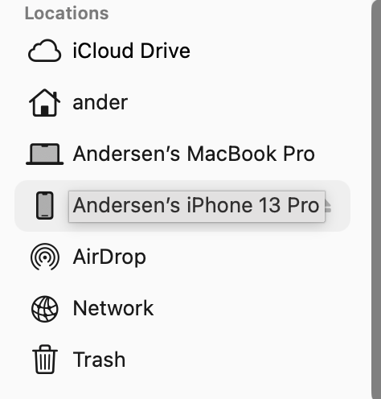
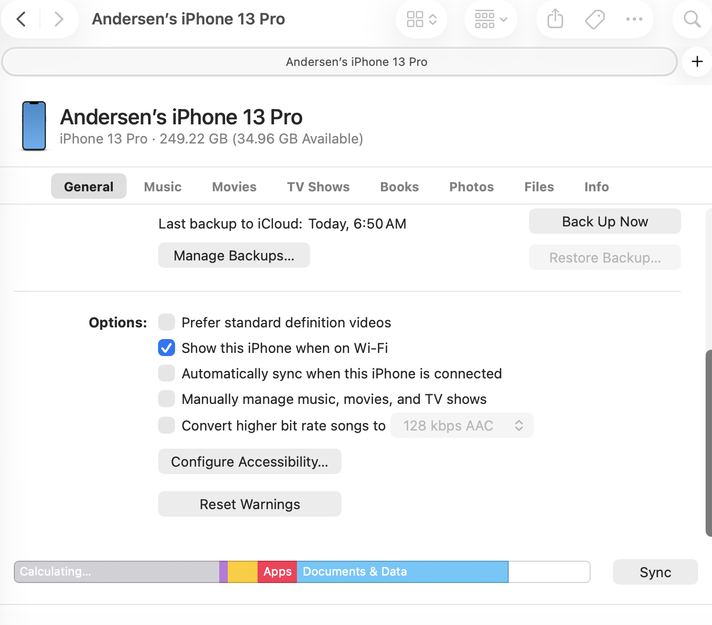
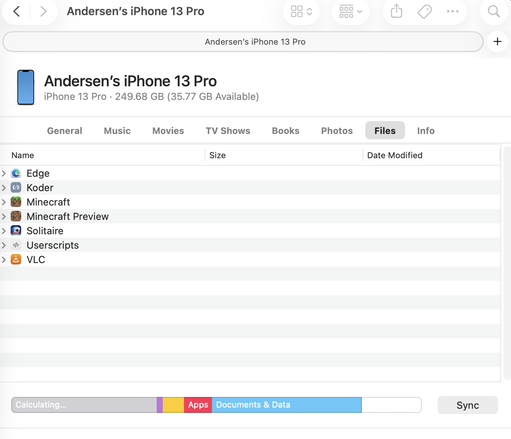

# Editing iPhone/iPad Worlds Using Your Computer

With this app, it is possible to edit worlds from your iPhone or iPad using your computer without manually transferring the world files to your computer and back to your iPhone/iPad again.

On macOS it is also possible to edit your device's worlds over Wi-Fi without using a cable.

> [!NOTE]
> This does **NOT** require a jailbroken device. You can do it on any iPhone/iPad.

## macOS

First, install Homebrew.

Then, if you have `osxfuse` installed, uninstall it:

```zsh
brew uninstall osxfuse
```

Then, install `macfuse`:

```zsh
brew install --cask macfuse
```

Then, install `ifuse`:

```zsh
brew install gromgit/fuse/ifuse-mac
```

Then, choose the commands below for your use case.

> [!IMPORTANT]  
> After running these commands for the first time, you will likely see an error about needing to allow a kernel extension.
>
> Instructions on how to do this can be found here: [https://github.com/macfuse/macfuse/wiki/Getting-Started#kernel-backend](https://github.com/macfuse/macfuse/wiki/Getting-Started#kernel-backend).
>
> If you can't figure out where the Startup Security Utility is, it can be accessed by going to Options in the Recovery Environment, then once you get past entering your password to continue, click `Utilities > Startup Security Utility` in the menu bar at the top of the screen.
>
> Once you have allowed the kernel extension and restarted your computer, you can run the commands below again and they will work as expected.

Below are the commands to mount the iPhone or iPad's Minecraft and Minecraft Preview documents folders.

Before running these, you will need to create the `/Volumes/iPhone-Minecraft` and/or `/Volumes/iPhone-MinecraftPreview` folders on your computer.

To get to the `Volumes` folder, do Shift+Command+G in Finder, then type `/Volumes` and press return.

### Connecting using a cable:

To connect to your iPhone/iPad using a cable, use the following commands:

```zsh
ifuse --documents com.mojang.minecraftpe /Volumes/iPhone-Minecraft
ifuse --documents com.mojang.minecraftpreview /Volumes/iPhone-MinecraftPreview
```

### Connecting over Wi-FI:

To allow your iPhone/iPad to connect over Wi-Fi do the following (these steps only need to be done the first time):

1. Connect your iPhone/iPad to your computer with a cable
2. Go to Finder.
3. Click on your iPhone/iPad in Locations section of the sidebar.

    

4. Scroll down to the bottom of the General tab and check "Show this iPhone when on Wi-Fi".

    

> [!NOTE]
> If the below commands say:\
> `ERROR: No device found! Ensure that the device is connected and usbmuxd is properly installed.`\
> then you may need to go into Finder and click on your iPhone/iPad in the Locations section of the sidebar to make it connect.

To connect to your iPhone/iPad over Wi-Fi, use the following commands:

```zsh
ifuse -n --documents com.mojang.minecraftpe /Volumes/iPhone-Minecraft
ifuse -n --documents com.mojang.minecraftpreview /Volumes/iPhone-MinecraftPreview
```

If you have multiple devices connected to your computer over Wi-Fi, you can use the `-u` flag to specify a specific device by UDID.

Example:

```zsh
ifuse -u 00008030-0000000000000000 --documents com.mojang.minecraftpe /Volumes/iPhone-Minecraft
```

You can get the device's UDID by using the following command:

```zsh
idevice_id
```

It will output a list of the UDIDs of all the connected devices.

You can then use the following command to get the names of the devices that each UDID corresponds to:

```zsh
idevicename -n -u 00008030-0000000000000000
```

You can access worlds from multiple devices at once if you mount each of them to different folders in the `/Volumes` folder.

---

To see your iPhone/iPad's worlds in the app, click on the "Show more" button at the bottom of the world list.

It may take a 1-30 seconds for your worlds to appear.

The following factors affect how long it takes:

-   How may worlds you have on your iPhone/iPad.
-   Your Wi-Fi connection (if you are connected over Wi-Fi).
-   The quality of the cable you are using (if you are using a cable).
-   If the cable is USB-C or USB-A (USB-C is faster) (if you are using a cable).
-   If the cable is connected to one of your Mac's Thunderbolt ports (this makes it faster) (if you are using a cable).
-   If the cable is connected directly to your Mac or to a hub (directly to the Mac is faster) (if you are using a cable).
-   The speed of your Mac (minimal impact).
-   The speed of your iPhone/iPad (minimal impact unless your phone is really old, and thus has a slow connection to your Mac).

### Unmounting the volumes:

If your iPhone/iPad gets disconnected and you don't want to restart your computer before reconnecting it, you can unmount the volumes using the following commands to allow you to remount it:

```zsh
umount /Volumes/iPhone-Minecraft
umount /Volumes/iPhone-MinecraftPreview
```

### Useful Scripts

There are some premade script files to mount/unmount/remount the volumes for your iPhone/iPad's Minecraft and Minecraft Preview documents folders.

You can find them [here](.github/assets/scripts/macOS_iPhone_Minecraft_mounting_scripts.zip).

These scripts also handle creating the folders for the volumes.

Make sure you configure `.sh` files to open with Terminal by default, so you can run the scripts by double clicking them.

-   `mount_iPhone_Minecraft_wired.sh` - Mounts the volumes using a wired connection.
-   `mount_iPhone_Minecraft_Wi-Fi.sh` - Mounts the volumes over Wi-Fi.
-   `remount_iPhone_Minecraft_wired.sh` - Unmounts the volumes, then mounts them again using a wired connection. Useful if your iPhone/iPad gets disconnected, you can run this and it will reconnect it. This is also useful to quickly switch from Wi-Fi to a wired connection.
-   `remount_iPhone_Minecraft_Wi-Fi.sh` - Unmounts the volumes, then mounts them again using Wi-Fi. Useful if your iPhone/iPad gets disconnected, you can run this and it will reconnect it. This is also useful to quickly switch from a wired connection to Wi-Fi.
-   `unmount_iPhone_Minecraft.sh` - Unmounts the volumes.

### Troubleshooting

---

#### The mounting commands are throwing `There was an error accessing the mount point: Input/output error`

If you get this error, you need to unmount the volume first. See [Unmounting the volumes](#Unmounting-the-volumes).

---

#### The mounting commands are throwing `Ensure that the device is connected and usbmuxd is properly installed.`

Try running the commands again after a few seconds.

If that doesn't work, try turning your computer's Wi-Fi off and back on.

If that doesn't work, try turning your iPhone/iPad's Wi-Fi off and back on.

If that doesn't work, try the below instructions.

If you are connecting with a cable, make sure the iPhone/iPad is showing up in the Locations section of the left sidebar in Finder. If not, double check that your iPhone/iPad is connected properly.

If you are connecting over Wi-Fi, make sure your iPhone/iPad is showing up in the Locations section of the left sidebar in Finder. If not, follow the instructions above to allow your iPhone/iPad to connect over Wi-Fi. If your iPhone/iPad is showing up in the Locations section of the left sidebar in Finder, then click on your iPhone/iPad in Finder and go to the Files tab and make sure it isn't empty.\
It should look like this:\
\
If it is empty, then your iPhone/iPad isn't connected.\
Try making sure no Finder windows have your iPhone/iPad open, then turn your computer's Wi-Fi off and back on, then click on your iPhone/iPad in Finder again.\
This should cause it to reconnect and show app data in the Files tab after 1-30 seconds.\
If it still doesn't connect, connect the cable to your Mac and go to the Files tab, then switch off of the iPhone/iPad in Finder, unplug the cable, then go back to your iPhone/iPad in Finder and try again.\
If that didn't work, do it again but click the eject button next to your iPhone/iPad in Finder first.

If none of that works, make sure `usbmuxd` is properly installed.

---

## Linux

TODO

<!-- TODO -->

## Windows

TODO

<!-- TODO -->
